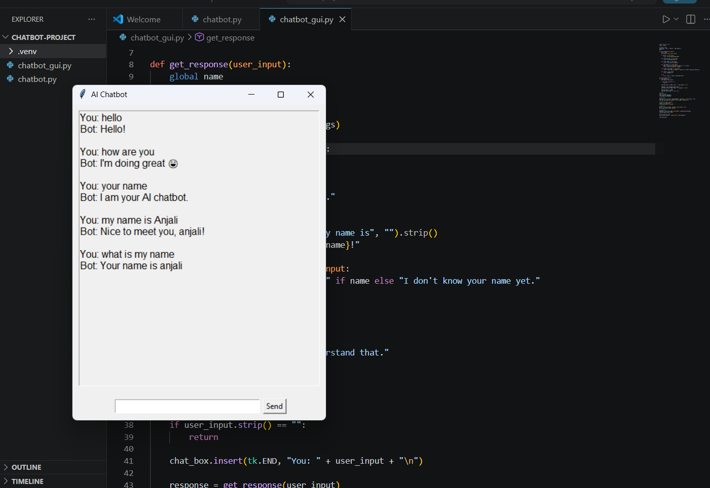

# 🤖 AI Chatbot (Python + Tkinter)

## 📌 Description
This is a GUI-based chatbot built using Python. It can respond to user queries and remember user names.

## 🚀 Features
- Chat interface (GUI)
- Random greetings
- Memory (stores user name)
- Basic conversation

## 🛠️ Tech Stack
- Python
- Tkinter


---

## ✅ To THIS:

```md
## ▶️ How to Run
```bash
python chatbot_gui.py

